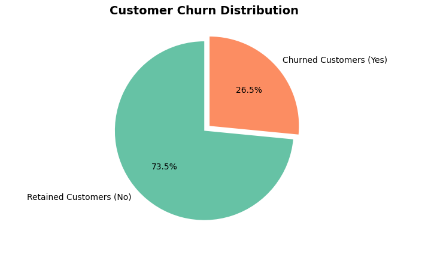
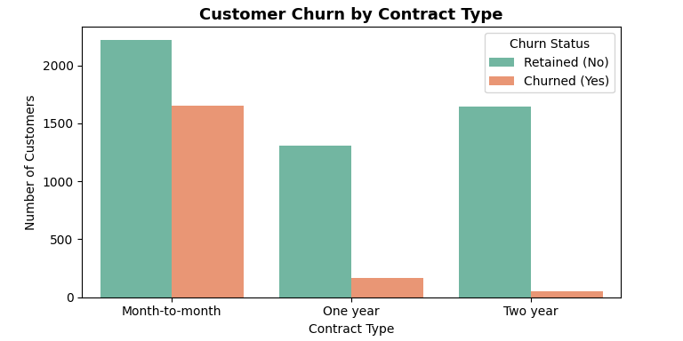
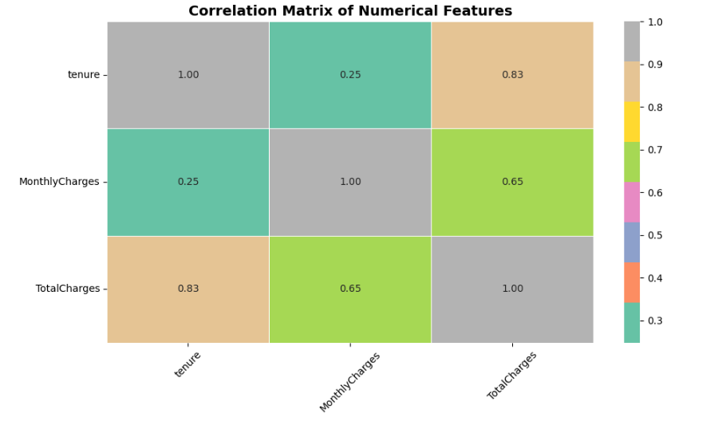

# Telecom Customer Churn Analysis

## Project Overview

Customer churn is a critical problem in the telecom industry because acquiring new customers is significantly more expensive than retaining existing ones. This project analyzes telecom customer data to understand the factors that influence customer churn and builds machine learning models to predict whether a customer is likely to leave the service.

The project includes **data cleaning, exploratory data analysis (EDA), feature preprocessing, and predictive modeling** to identify patterns associated with customer churn.

---

## Dataset

The dataset used in this project is the **Telco Customer Churn Dataset**, which contains information about telecom customers including their demographics, subscribed services, billing details, and churn status.

Key features in the dataset include:

- Customer demographics
- Contract type
- Internet service
- Online security and tech support
- Monthly charges
- Total charges
- Tenure
- Churn status (Target variable)

Each row represents one customer.

---

## Tools & Technologies

The project was developed using the following tools and libraries:

- **Python**
- **Pandas** – Data manipulation and cleaning
- **NumPy** – Numerical computations
- **Matplotlib** – Data visualization
- **Seaborn** – Statistical visualization
- **Scikit-learn** – Machine learning models and evaluation
- **Jupyter Notebook** – Development environment

---

## Project Workflow

### 1. Data Loading

The dataset was loaded using Pandas and initial inspection was performed to understand:

- Data structure
- Missing values
- Feature types

---

### 2. Data Cleaning & Preprocessing

Data preprocessing steps included:

- Handling missing values
- Converting **TotalCharges** to numeric
- Encoding categorical variables
- Feature scaling using **StandardScaler**
- Splitting the dataset using **train_test_split**

---

### 3. Exploratory Data Analysis (EDA)

EDA was performed to identify patterns and relationships between features and churn.

Key aspects analyzed:

- Churn distribution
- Contract type vs churn
- Monthly charges vs churn
- Tenure vs churn
- Service subscription patterns

Various visualization techniques were used such as:

Count plots
- Distribution plots
- Line plots
- Box plots
- Pie charts
- Heatmaps
- Correlation analysis

---

## Machine Learning Models

Two classification models were implemented to predict customer churn.

### Logistic Regression

A baseline classification model used to understand linear relationships between features and churn.

### Random Forest Classifier

An ensemble learning model that improves prediction accuracy by combining multiple decision trees.

---

## Model Evaluation

The models were evaluated using the following metrics:

- **Accuracy Score**
- **ROC AUC Score**
- **Confusion Matrix**
- **Classification Report**

These metrics help assess the model’s ability to correctly classify churned and retained customers.

---

## Key Insights

From the exploratory data analysis and modeling process, several important insights were identified:

- Customers with **month-to-month contracts** have significantly higher churn rates.
- Higher **monthly charges** are associated with increased churn probability.
- Customers without **online security or tech support services** are more likely to churn.
- **Customer tenure** plays an important role in retention, with longer-tenure customers showing lower churn rates.

These insights can help telecom companies design **customer retention strategies**.

---

## Key Visualizations

### Churn Distribution

This visualization shows the proportion of customers who churned compared to those who remained with the company.



---

### Contract Type vs Churn

Customers with **month-to-month contracts** have significantly higher churn rates compared to yearly contracts.



---

### Correlation Heatmap

The heatmap highlights relationships between numerical variables such as **tenure, monthly charges, and total charges**.




## Project Structure

```
telecom-customer-churn-analysis
│
├── data
│   └── Telco-Customer-Churn-Data.csv
|   └── Telco-Customer-Churn-Data(Cleaned).csv
│
├── notebooks
│   └── Customer_Churn_Analysis.ipynb
│
├── images
│   └── churn_distribution.png
|   └── churn_distribution.png
|   └── churn_distribution.png  
│
├── requirements.txt
└── README.md
```

---

## How to Run the Project

Clone the repository:

```bash
git clone https://github.com/yourusername/telecom-customer-churn-analysis.git
```

Navigate to the project folder:

```bash
cd telecom-customer-churn-analysis
```

Install required dependencies:

```bash
pip install -r requirements.txt
```

Launch Jupyter Notebook:

```bash
jupyter notebook
```

Open the notebook and run all cells to reproduce the analysis.

---

## Future Improvements

Potential improvements for this project include:

- Hyperparameter tuning for model optimization
- Feature importance analysis
- Model comparison with additional algorithms
- Building an interactive dashboard using **Streamlit or Power BI**
- Deploying the churn prediction model

---

## Author

**IqraIzhar**
- **LinkedIn:** [linkedin.com/in/iqra-izhar-08b8b8330](https://www.linkedin.com/in/iqra-izhar-08b8b8330)  
- **GitHub:** [github.com/iqraizhar72](https://github.com/iqraizhar72)
- **Email:** [iqraizhar72@gmail.com](mailto:iqraizhar72@gmail.com)

## Feedback & Support

Feel free to share suggestions or compliments — your feedback is appreciated!  
If you found this project useful, please consider giving it a ⭐️.

